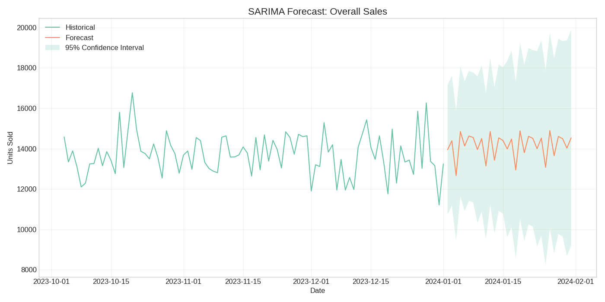
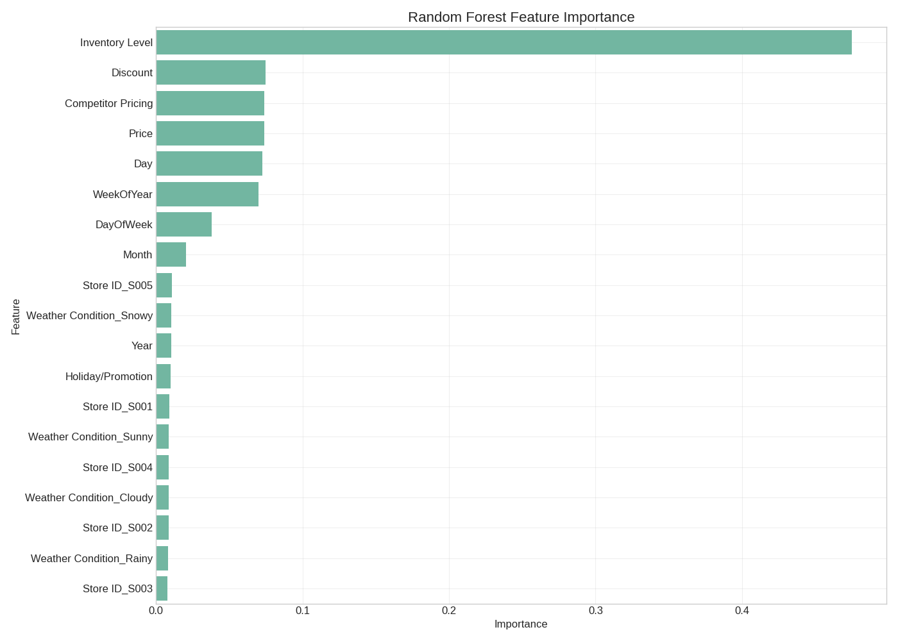
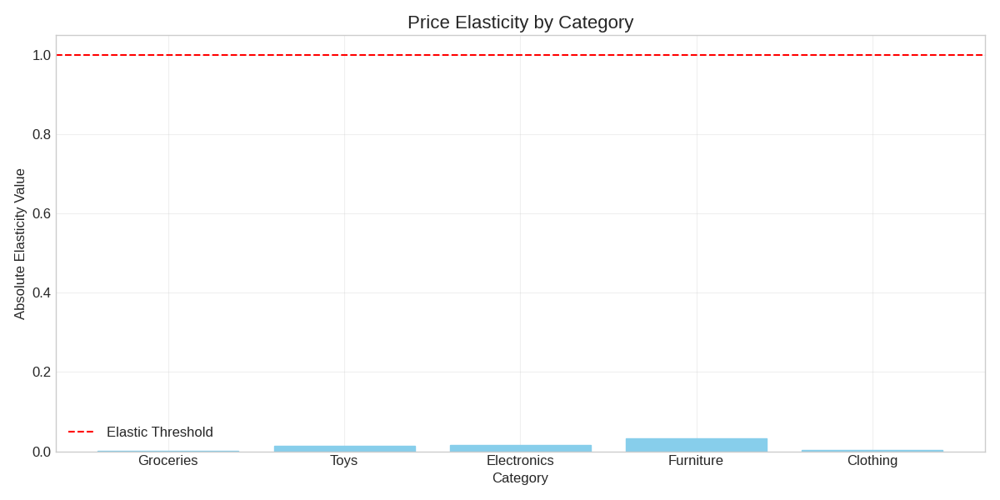
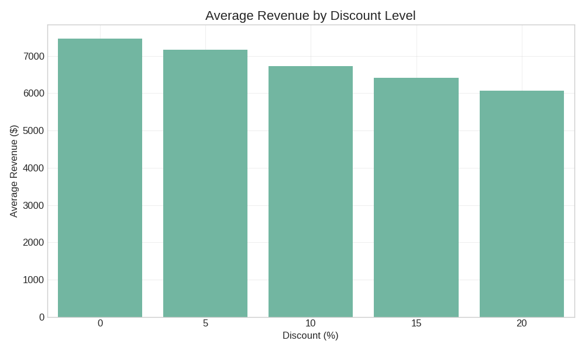

# Retail Inventory Management - Executive Dashboard

Report Generation Date: 2025-03-21 15:51:12

## Executive Summary

This comprehensive analysis provides data-driven insights and recommendations for optimizing retail inventory management:

### Key Metrics

| Metric | Value |
|--------|-------|
| Forecast Model R² | 0.30 |
| Products Analyzed | 20 |
| Inelastic Products | 20 |

### Key Insights

4. **Optimal Discount**: 0.0% discount maximizes revenue
5. **Competitive Positioning**: -2% to 0% vs. competitors optimizes revenue

## Analysis Visualization Gallery

### Seasonal Patterns

  

    
    
<em>Monthly Sales Trend</em>

  

  

    
    
<em>Seasonal Sales Pattern</em>

  

  

    
    
<em>Monthly Sales by Category</em>

  

  

    
    
<em>Monthly Sales by Region</em>

  

### Inventory Status

  

    
    
<em>Supply Status Distribution</em>

  

  

    
    
<em>Supply Metrics by Category</em>

  

  

    
    
<em>Most Oversupplied Products</em>

  

  

    
    
<em>Most Undersupplied Products</em>

  

### Demand Forecasting

  

    
    
<em>Overall Sales Forecast</em>

  

  

    
    
<em>Forecast Model Feature Importance</em>

  

  

    
    
<em>Actual vs Predicted Sales</em>

  

  

    
    
<em>Forecast Accuracy Analysis</em>

  

### Pricing Strategy

  

    
    
<em>Price Elasticity by Category</em>

  

  

    
    
<em>Discount Impact on Revenue</em>

  

  

    
    
<em>Revenue by Competitive Price Position</em>

  

  

    
    
<em>Price vs Units Sold</em>

  

## Detailed Recommendations

### Forecasting Recommendations

Based on the forecasting models, we recommend:

1. **High Priority Inventory Planning**: Focus on products with strong upward sales trends
2. **Seasonal Adjustments**: Adjust inventory levels based on identified seasonal patterns
3. **Store-Specific Strategies**: Implement store-specific inventory levels based on forecast models
4. **Forecast Accuracy Improvements**: Consider adding external factors to improve forecast accuracy
5. **Early Warning System**: Monitor forecast vs. actual sales daily to catch deviations early
### Inventory Recommendations

1. **Implement Reorder Points**: Configure inventory systems to alert when stock reaches reorder points
2. **Order in EOQ Quantities**: Place orders in economic order quantities to minimize total costs
3. **Maintain Safety Stock**: Ensure safety stock levels are maintained to buffer against demand uncertainty
4. **Review Periodically**: Review and adjust these parameters quarterly based on updated demand patterns
5. **Monitor Service Levels**: Track stockouts and adjust safety stock if service levels are not being met
### Pricing Recommendations

1. **Dynamic Pricing**: Implement dynamic pricing for highly elastic products
2. **Price Skimming**: For inelastic categories, gradually decrease prices from initial high points
3. **Penetration Pricing**: For elastic categories, start with lower prices to gain market share
4. **Psychological Pricing**: Use price points ending in .99 for elastic products
5. **Bundle Pricing**: Create bundles for complementary products, especially with elastic items
6. **Price Anchoring**: Display premium products alongside standard offerings to increase perception of value
7. **Seasonal Adjustments**: Adjust pricing strategies by season based on the seasonality analysis
## Implementation Plan

### Short-Term Actions (1-3 months)

1. **Inventory Adjustment**: Immediately address critical undersupplied products
2. **Price Optimization**: Implement recommended price changes for elastic products
3. **Forecast Integration**: Integrate forecasting models into inventory planning

### Medium-Term Actions (3-6 months)

1. **System Integration**: Configure inventory systems with reorder points and safety stock levels
2. **Category Strategy**: Implement category-specific pricing and inventory strategies
3. **Staff Training**: Train staff on new inventory management procedures

### Long-Term Actions (6-12 months)

1. **Continuous Improvement**: Refine forecasting models with new data
2. **Advanced Analytics**: Develop more sophisticated pricing optimization algorithms
3. **Supplier Integration**: Integrate inventory system with supplier ordering

## Conclusion

This comprehensive analysis provides a data-driven foundation for optimizing retail inventory and pricing strategies. By implementing these recommendations, the organization can expect reduced inventory costs, improved service levels, and optimized pricing for profitability while maintaining customer satisfaction.

---

*Report generated in 0.01 seconds*
