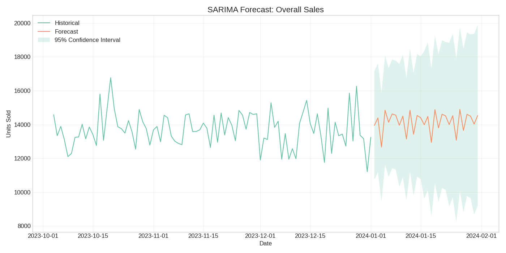
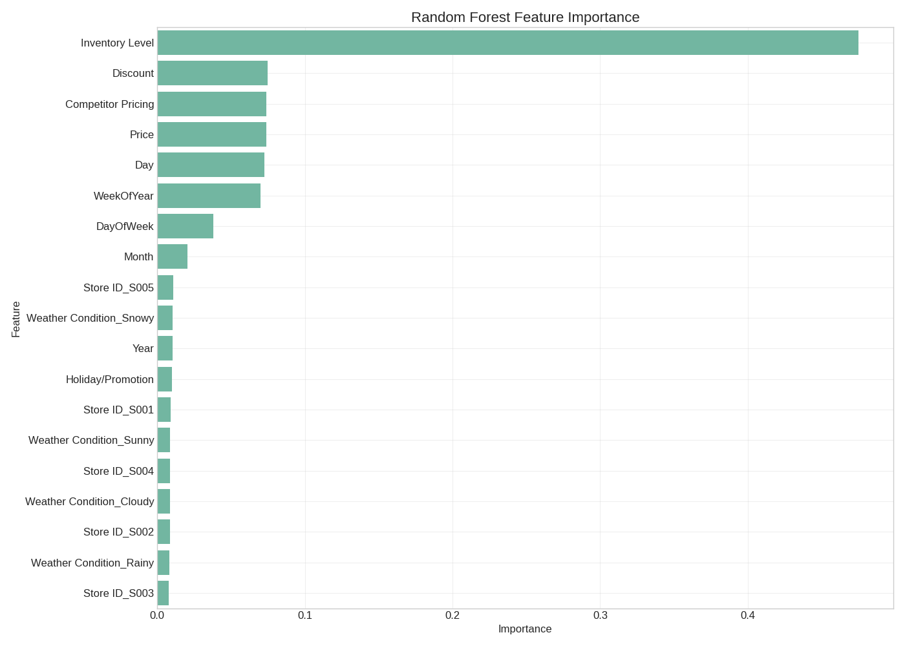
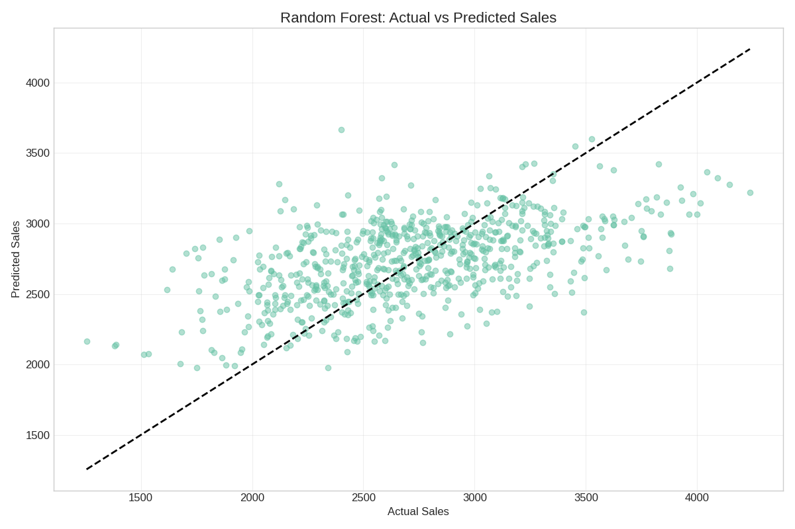

# Demand Forecasting Report

Analysis Date: 2025-03-21 15:51:03

## Forecast Summary

This report provides demand forecasts at multiple levels (overall, category, product) using SARIMA and machine learning models.

## Time Series (SARIMA) Models

### Overall Sales Forecast

- MAE: 1192.26
- RMSE: 1439.47
- R²: -0.88

### Category Forecasts

| Category | RMSE | MAE | R² |
|----------|------|-----|----|
| Groceries | 822.91 | 664.24 | -0.25 |
| Toys | 828.30 | 675.75 | -0.47 |
| Furniture | 874.15 | 697.75 | -0.32 |
| Clothing | 989.55 | 796.14 | -0.79 |
| Electronics | 1169.87 | 940.13 | -1.80 |

### Product Forecasts

| Product ID | RMSE | MAE | R² |
|------------|------|-----|----|
| P0020 | 279.01 | 223.40 | -0.65 |
| P0014 | 285.29 | 228.74 | -0.53 |
| P0015 | 288.44 | 234.89 | -0.51 |
| P0005 | 293.90 | 244.36 | -0.59 |
| P0016 | 388.22 | 315.86 | -1.50 |

## Machine Learning Forecast Model

- Model Type: random_forest
- MAE: 329.10
- RMSE: 415.03
- R²: 0.30

### Top 20 Features by Importance

| Feature | Importance |
|---------|------------|
| Inventory Level | 0.4748 |
| Discount | 0.0750 |
| Competitor Pricing | 0.0739 |
| Price | 0.0738 |
| Day | 0.0727 |
| WeekOfYear | 0.0699 |
| DayOfWeek | 0.0382 |
| Month | 0.0204 |
| Store ID_S005 | 0.0108 |
| Weather Condition_Snowy | 0.0103 |
| Year | 0.0102 |
| Holiday/Promotion | 0.0099 |
| Store ID_S001 | 0.0093 |
| Weather Condition_Sunny | 0.0088 |
| Store ID_S004 | 0.0087 |
| Weather Condition_Cloudy | 0.0086 |
| Store ID_S002 | 0.0085 |
| Weather Condition_Rainy | 0.0084 |
| Store ID_S003 | 0.0077 |

## Recommendations

Based on the forecasting models, we recommend:

1. **High Priority Inventory Planning**: Focus on products with strong upward sales trends
2. **Seasonal Adjustments**: Adjust inventory levels based on identified seasonal patterns
3. **Store-Specific Strategies**: Implement store-specific inventory levels based on forecast models
4. **Forecast Accuracy Improvements**: Consider adding external factors to improve forecast accuracy
5. **Early Warning System**: Monitor forecast vs. actual sales daily to catch deviations early
